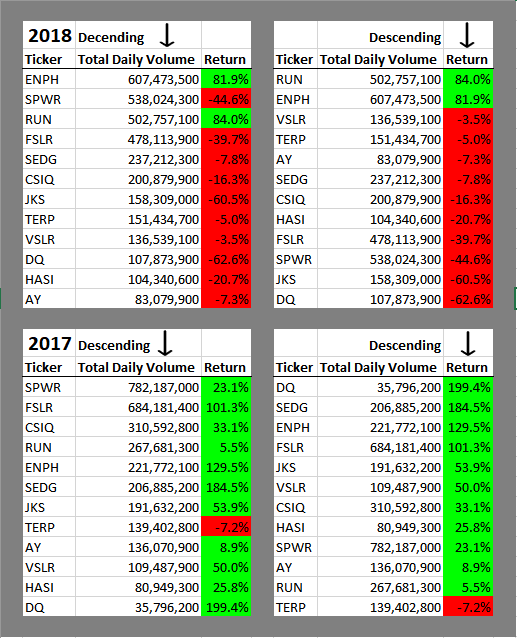
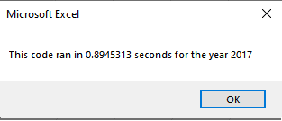

# stock-analysis
# An Analysis of Stock Data
Using VBA Macros to analyze volume and return of various stock tickers. Refactor code to improve script execution times. 

## Overview of Project
>Macro enabled calculations performing data analysis of daily volume and return on investment of 12 stocks.
### Purpose
>Compare volume and return data of various stocks to determine best options for diversifying portfolio. 
## Results

### Analysis of Stock Performance from 2017 to 2018
>Output of daily volume sum and percent return for each stock simplifies comparison of their performance.

  
 
>Conditional formatting provides quick visual reference for positive and negative return rates.
### Interpretation of Data
>In 2017, the stock for ticker SPWR acheived the highest total daily volume with a value of 782,187,000. 
>Stock for ticker DQ, the client's current investment, had the lowest daily volume but the highest rate of return at 199.4%.
>In 2018, the stock for ticker ENPH acheived the highest total daily volume with a value of 607,473,500.
>Stock for ticker RUN had the highest return rate at 84%.
### Overall Observations  
>All but one stock had a positive return on investment in 2017, whereas all but two had negative returns in 2018 indicating an overall decline in stock values across the board in 2018. 
### Script Execution Times
>Refactoring the code to allow for larger data sets showed an improvement in execution time of approximately 8% for both 2017 and 2018.  
>Script execution times were tracked via macro using the Timer function to count the seconds elapsed from the time the requested year was submitted through the input box (yearValue = InputBox("What year would you like to run analysis on?")) until the end of the script and then relayed via message box (MsgBox "This code ran in " & (endTime - startTime) & " seconds for the year " & (yearValue)). 

>Original Script

>Original Script

>Refactored Script

>Refactored Script
## Summary

### Advantages and Disadvantages of Refactoring
>While there can be disadvantages to refactoring such as the time investment and potential for breaking the code, those can often be outweighed by the advantages. Advantages include not only reduced script execution time but can also improve code readability and potentially replace counterproductive kludges.
- Pros and Cons of refactoring original VBA script
>Refactoring the script for this stock analysis showed a marginal increase in execution effectiveness by storing multidimensional data rather than repeated loops for each stock being analyzed. Given the small number of unique stock tickers in this data set it can be extrapolated that the impact would be more profound with a significant number of stocks. The most apparent cons to the refactoring could include the initial time investment but that would be easily justified if the script is of continued use, and the potential for developing bugs in the original code which could be mitigated by preserving the original script to compare or revert to. 